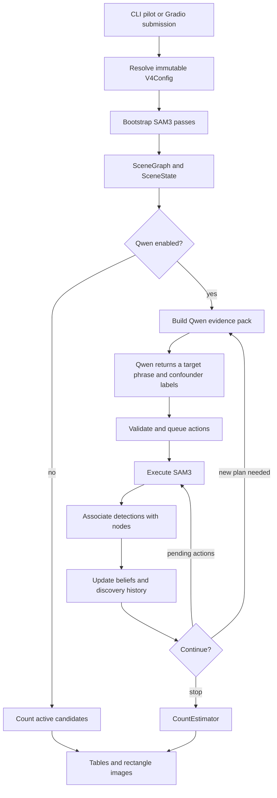

# V4 code walkthrough

This is a reading guide to the implementation under `src/sam3_vlm`, including
the single-image GUI. It excludes test files and generated run directories.
Read it beside the source: the named classes and methods are search targets in
your editor. The descriptions distinguish the current fruit-counting path from
generic or older experimental paths that are still present.

The system builds a set of candidate objects using SAM3, asks Qwen for further
search descriptions, then updates each candidate's target probability using
subsequent SAM3 observations. Qwen proposes experiments; it does not return the
final count. The final soft count is computed in Python from the scene graph.

## Contents

- [Suggested reading order](#1-a-useful-order-for-the-mentor-meeting)
- [One image through the pipeline](#2-follow-one-image-through-the-code)
- [Core types and config](#3-core-types-and-configuration)
- [Model boundaries](#4-sam3-and-qwen-model-boundaries)
- [Sensing and evidence](#5-sensing-requests-and-qwen-evidence)
- [Scene graph and confidence equations](#6-scene-representation-association-and-confidence)
- [Planning and stopping](#7-planning-and-stopping)
- [Pipeline orchestration](#8-pipeline-orchestration)
- [Logging and replay](#9-logging-and-reproducibility-code)
- [Datasets and evaluation](#10-dataset-and-evaluation-modules)
- [Experiments and exports](#11-experiment-entry-points-and-final-outputs)
- [GUI and package initializers](#12-the-gradio-app-and-package-initializers)
- [Questions and implementation limits](#13-questions-to-be-ready-to-answer-honestly)
- [Source navigation commands](#14-source-navigation-commands)

## 1. A useful order for the mentor meeting

For a 15-minute explanation, open these files in this order:

1. `core/config.py`: what is configurable, and which defaults are overridden.
2. `pipeline/runner.py`, `Runner._step`: the actual control flow.
3. `pipeline/bootstrap.py`, `execute_bootstrap`: where candidates originate.
4. `models/sam3.py`, `RealSAM3Sensor.observe`: the model boundary and coordinates.
5. `scene/association_dual.py`, `associate`: why repeated detections are not simply added.
6. `scene/belief.py`, `compute_likelihoods` and `update_node_belief`: the confidence equation.
7. `scene/state.py`, `CountEstimator.estimate`: how probabilities become a count.
8. `models/qwen.py`, `RealQwenPlanner.plan_scene`: the exact Qwen request builder.
9. `planning/action_bank.py`, `generate_entries`: what Qwen is allowed to execute.
10. `experiments/m8_smoke.py`, `_pilot_variants`: the A–E experimental differences.

Then show the GUI. If asked how a result can be audited, open
`logging/writer.py` and `logging/replay.py`. The rest of this guide covers every
source module, so you can follow a question into the relevant implementation.

### Vocabulary used by the code

| Term | Concrete meaning |
|---|---|
| Detection | One SAM3 box, score and optional mask from one query |
| Node | A persistent candidate object, with a box and observation history |
| Graph | Dictionary of nodes; this is not a graph neural network |
| Action | An immutable SAM3 request: phrase, family, threshold, spatial mode, optional exemplars |
| Semantic key | In current M8, a probability coordinate such as `target` or `confounder1` |
| Correlation group | A history key used to discount repeated evidence |
| Evidence pack | Image references, candidate samples, diagnostics and history sent to Qwen |
| Replan | Ask Qwen for a new plan after sensing; a repair/correction is a different reason to call it |
| Discovery | Target sensing that may create new nodes |
| Verification/confounder | Sensing that updates represented candidates without adding countable nodes |
| Bootstrap | Initial SAM3 passes before Qwen is called |

## 2. Follow one image through the code



**Entry and configuration.** The final experiment enters through
`m8_smoke.main`, then `m8_4_and_5_pilot`. The GUI enters through `gui.app.main`,
then the Run callback and `SingleImageService.run`. They use the same deployment
config loader and final-A–E preset definitions. A fresh runner is constructed
for each Qwen-enabled image. Model instances can be reused; graph state cannot.

**Bootstrap.** With the selected D configuration, SAM3 first queries `tree canopy`.
The controller takes one enclosing rectangle around the returned context boxes
and locks that search domain. If none is found, the configured fallback is the
full image. Context detections do not become fruit nodes. It then searches for
the user's target at 0.25. Strong sensor detections can seed an optional second
global pass with positive exemplar boxes. A sufficiently large search region can
also receive an overlapping tiled pass. Each target pass is associated into the
same graph, rather than having its detection count added to a total.

**Planning.** The bootstrap prepares the original image and a contact sheet of
up to 24 sampled candidate crops. Their metadata distinguishes target-family
sensor support from the current target posterior. Qwen receives these images,
the user's target, fixed scope, recorded diagnostics and the request contract.
It proposes at most one target phrase. When negatives are enabled, its separate
confounder labels are converted by the controller into negative SAM3 actions.

**Sensing and belief updates.** The action bank rejects duplicates, malformed
phrases, wrong semantic priors and unauthorized ROI geometry. The controller
assigns the configured thresholds, not whatever cutoff Qwen happened to suggest.
SAM3 observations are associated with existing nodes. Only discovery may add
unmatched detections to the counted graph. Matches and relevant non-retrievals
update existing beliefs. The scene records gains, uncertainty, coverage and cost.

**Continue or stop.** The controller executes pending target/negative actions,
checks budgets and saturation, and decides whether a replan is useful. An empty
or invalid plan can get a bounded correction if there is a remaining Qwen call.
The final count comes from active-node beliefs. A/B bypass the planner loop and
report the number of active bootstrap candidates instead.

**Report.** Experiment code compares the result with GT only after inference.
The GUI also keeps optional GT out of model inputs. The final renderer draws
every active candidate, without changing the probabilities or count.

## 3. Core types and configuration

### [`src/sam3_vlm/core/config.py`](../src/sam3_vlm/core/config.py)

Defines frozen dataclasses, collected by `V4Config`. “Frozen” prevents assigning
new field values on a config object. Experiments create variations using
`dataclasses.replace`, including replacing the nested dataclass being changed.

The sections are `TilingConfig` (grid/overlap), `BudgetConfig` (calls/tiles/time),
`StoppingConfig` (termination thresholds), `BootstrapConfig` (context/exemplars),
`PlannerConfig` (Qwen policy/request options), `SAM3Config` (admission thresholds),
`ActionSelectionConfig` (utility weights), `AssociationConfig` (overlap gates),
`BeliefConfig` (ontology/discount/counting), `ReplanningConfig`, `CleanupConfig`,
and `LoggingConfig`. `V4Config` also holds device and output/asset directories.

`SAM3Config.threshold_for_family` chooses the discovery or confounder override,
falling back to `qwen_prompt_threshold` if that override is null. Bootstrap uses
`default_threshold` separately. `BeliefConfig.__post_init__` prevents enabling
hard counting and commitment at the same time. Validation is selective; not all
core fields have range checks. The GUI adds validation at the form boundary.

Do not quote these generic defaults as the final experiment settings. The JSON
deployment file and `_pilot_variants` override them. Some retained configuration
fields have no effect in the current path; see the review notes in section 13.

### [`src/sam3_vlm/core/types.py`](../src/sam3_vlm/core/types.py)

Contains the shared enums and data records. `ActionFamily` distinguishes target
discovery, confounders, context and verification. `SpatialMode` distinguishes
global, tiled and local/ROI execution. `ActionSource` records who requested an
action. `ObservationRelation` records how a sensor result relates to a node.
`StopReason` is the structured explanation for termination.

`Detection` is transient sensor output. `NodeObservationRef` links a node to an
action, SAM3 call, detection and relation. `ClassBelief` stores normalized class
probabilities, checks finite/nonnegative values and recomputes entropy in bits.
`BudgetState` separates SAM3, Qwen, controller and wall time. `RegistrationDiagnostics`
contains support and overlap-risk summaries. None of these records owns a model.

### [`src/sam3_vlm/core/geometry.py`](../src/sam3_vlm/core/geometry.py)

`Box` stores `x1,y1,x2,y2`, with an explicit coordinate space. It provides width,
height, area, intersection, union and IoU. Intersection rejects mixed coordinate
spaces. `Geometry` is a protocol; `BoxGeometry` implements it for rectangles.
`GeometryRef` adds an optional external mask reference. `PolygonGeometry` computes
polygon area with the shoelace formula, but its IoU is only bounding-box IoU.
`deserialize_geometry` reconstructs supported shapes from recorded dictionaries.

The production graph is box-based even when SAM3 emits masks. Do not describe
node association as mask-IoU matching: it uses the boxes.

### [`src/sam3_vlm/core/id_generator.py`](../src/sam3_vlm/core/id_generator.py)

`IDGenerator` maintains one counter per domain and produces identifiers such as
`node_000001`, `action_000001`, and `sam3_000001`. Convenience methods delegate
to `next_id`; `reset` clears counters. IDs persist through logs and graph history
instead of being transient array indices. Despite the class docstring's
“thread-safe” wording, there is no lock in this class. The GUI serializes work
and keeps each runner's generator separate.

## 4. SAM3 and Qwen model boundaries

### [`src/sam3_vlm/models/sam3.py`](../src/sam3_vlm/models/sam3.py)

`SAM3Sensor` is the `observe(image, action)` protocol. `DummySAM3Sensor` and
`MockSAM3Adapter` supply deterministic non-model behavior for development; they
are not the real experiment backend. `RealSAM3Sensor` loads Hugging Face
`Sam3Model` and `Sam3Processor`, moves the model to the selected device and can
optionally compile it. CUDA enables TF32 options.

Follow `RealSAM3Sensor.observe` in this order:

1. Validate the action and resolve the PIL image.
2. `_clipped_domain` intersects the permitted search region/ROI with the image.
3. Check that exemplar IDs have executable, aligned boxes.
4. For TILED, `_tiles_within_domain` produces the crops. Other modes use one crop;
   ROI_BATCH currently means one enclosing crop, not a tensor batch of ROIs.
5. `_localize_exemplar_boxes` clips image-coordinate exemplar boxes to each crop
   and transforms them to processor coordinates. `_run_inference` passes text and
   positive/negative boxes to the processor and runs the model under `no_grad`.
6. Processor postprocessing applies the action's detection threshold and the
   fixed mask threshold 0.5. Boxes, scores and masks move back to CPU.
7. `_append_crop_detections` offsets local boxes into original-image coordinates,
   assigns IDs and retains crop-local mask offsets and geometry as provenance.
8. Return one `SAM3Observation` containing all detections and searched regions.

A tiled action is one controller SAM3 action but executes inference on several
crops. The separate tile budget makes that cost visible. The adapter does not
decide which boxes are fruit or whether the pipeline should stop.

### [`src/sam3_vlm/models/qwen.py`](../src/sam3_vlm/models/qwen.py)

`QwenPlanner` is a backend protocol. Dummy/mock implementations exercise the
controller without a remote service. `RealQwenPlanner` creates an OpenAI-compatible
client using the model alias, base URL and optional API key. The SDK's automatic
retries are disabled; the planner service owns bounded retry behavior.

`SYSTEM_PROMPT` holds the existing core instructions. `DISCOVERY_GUIDANCE_V3` and
`EVIDENCE_GUIDANCE_V4` are optional experimental additions, selected by
`planner.prompt_version`. Production uses `old`. `plan_scene` assembles the actual
request, so the final prompt is not just the `SYSTEM_PROMPT` constant:

- prepend the configured tree-fruit scope;
- apply the existing negative-query wording if that policy is enabled;
- include `QwenEvidencePack.to_prompt_text`, diagnostics and previous rejection feedback;
- append the short-phrase/action contract, frozen slot mapping, exact prompt
  blacklist, saturation instruction, controller threshold and JSON schema;
- attach the original supplied image and available contact-sheet image as data URLs.

The input contains detailed candidate evidence, not just a count. The adapter
does not explicitly resize the supplied images. The upstream bootstrap currently
saves the full image as a JPEG; the server/processor still controls its own
visual tokenization and context handling.

The request sets model, temperature, `max_tokens`, JSON-object response format,
timeout and reasoning mode. `last_request_text` records the exact system/user
text for the artifact writer without duplicating image base64. Real/GUI runs
use strict model errors. Model failures are not replaced with invented detections.
The GUI leaves this file and its instruction templates unchanged.

## 5. Sensing requests and Qwen evidence

### [`src/sam3_vlm/sensing/action.py`](../src/sam3_vlm/sensing/action.py)

`SensingAction` is the immutable executable request. It includes the phrase,
family, source, threshold, semantic prior, correlation group, spatial mode,
search domain, optional ROI and executable exemplar boxes. IDs supply provenance;
boxes are what the real SAM3 processor can actually use.

`validate` checks nonempty text/key, threshold range, exemplar consistency,
finite positive-area boxes and compatibility between spatial mode, tiling and
ROI. `validate_sam3_prompt_contract` is a separate lexical guard used for Qwen
phrases: one to three tokens, allowed token shape and a small set of forbidden
method/prose words. It is not a dictionary of permitted object vocabulary and
does not perform part-of-speech parsing. Noun-last grammar and target preservation
are instructions to Qwen, not guarantees supplied by this regex.

### [`src/sam3_vlm/sensing/observation.py`](../src/sam3_vlm/sensing/observation.py)

`SAM3Observation` is a small result record: call/action/key identifiers, detections,
searched regions, runtime and model metadata. The searched regions are important:
failure to retrieve a node is evidence only where the sensor could observe it.

### [`src/sam3_vlm/sensing/tiling.py`](../src/sam3_vlm/sensing/tiling.py)

`TilingDecision` carries the decision and crop geometry. `DefaultTilingPolicy`
requires both search-domain dimensions to meet a minimum resolution derived from
tile size and grid dimensions. Above that threshold it tiles; small candidates
change the explanation but are not a prerequisite for the high-resolution path.

`compute_tiles` divides the image into rows/columns and expands each crop by the
configured overlap fraction, clipped to image bounds. `tile_box_to_image_box`
and `image_box_to_tile_box` translate coordinates. The real adapter also localizes
tiles within a locked domain. Tile overlap can create duplicate detections; scene
association handles their suppression.

### [`src/sam3_vlm/sensing/evidence.py`](../src/sam3_vlm/sensing/evidence.py)

`CropCandidateAnnotation` carries one sampled node's box, target-family SAM3
support, latest observation, posterior and provenance. The old `sam3_score` alias
means target support; it does not mean posterior probability.

`ContactSheet` stores the selected annotations and rendered sheet reference.
`QwenEvidencePack` adds the original-image reference, target, summary, discovery
diagnostics and frozen ontology/labels. Serialization methods preserve that
structure. `to_prompt_text` produces the evidence portion of the model request;
the real adapter currently uses its full, non-compact form.

`_target_family_call_ids` and `_target_support_observation` recover the strongest
target-oriented detection evidence without overwriting it with a later negative
score or miss. `ContactSheetBuilder.build_contact_sheet` separates candidates into
high/medium/low sensor-score strata plus overlap-risk outliers. It takes a quota
from each and fills remaining positions in `x1+y1` order, up to the normal
24-crop budget. This is a heuristic sample, not a full inventory or rigorous
spatial stratification. Each crop is saved and annotated before rendering the sheet.
`EvidencePack` is an additional lightweight collection of sensor observations.

### [`src/sam3_vlm/sensing/visuals.py`](../src/sam3_vlm/sensing/visuals.py)

Image utilities for the evidence builder. `to_numpy_image` converts PIL RGB to
OpenCV BGR; existing NumPy arrays are assumed to already follow the expected
image convention. `crop_image_region` clips and extracts a rectangle. `save_image`
creates parent directories and calls OpenCV. `render_contact_sheet` resizes crops
to square 256-pixel panels in a four-column grid and pads unused slots with black.
These are Qwen input assets, separate from final rectangle-only result images.

## 6. Scene representation, association and confidence

### [`src/sam3_vlm/scene/node.py`](../src/sam3_vlm/scene/node.py)

`Node` groups one hypothesis's geometry, `ClassBelief`, registration diagnostics,
observation references, origin call, status and merge lineage. Convenience
properties expose selected diagnostic fields. `to_dict` and `from_dict` explicitly
serialize/reconstruct enums, boxes, probabilities and observation provenance.
No model object or dense GPU tensor belongs in a node.

### [`src/sam3_vlm/scene/graph.py`](../src/sam3_vlm/scene/graph.py)

`SceneGraph` is a node-ID dictionary. `add_node` rejects duplicate IDs;
`active_nodes` includes only `NodeStatus.ACTIVE`. `resolve_node` and `reject_node`
change lifecycle status. `merge_nodes` marks secondary nodes rejected and moves
their observation/lineage/support information to the primary node; it does not
recompute a newly calibrated posterior. JSON conversion carries a graph schema
version. The normal discovery loop primarily adds/updates nodes and does not
automatically invoke every available lifecycle method.

### [`src/sam3_vlm/scene/association.py`](../src/sam3_vlm/scene/association.py)

Defines `AssociationResult`, the `AssociationPolicy` protocol and the original
`IoUAssociationPolicy`. It compares detection boxes with represented nodes,
attaches strong/weak/ambiguous observation references and provisionally registers
unmatched detections as nodes. It also updates support and overlap diagnostics.
This is the IoU-only implementation retained for comparisons and generic runs.

This policy is not the Hungarian matcher from `evaluation/matching.py`.
Association is an online graph operation; evaluation matching compares predictions
with annotations after inference.

### [`src/sam3_vlm/scene/association_dual.py`](../src/sam3_vlm/scene/association_dual.py)

This is the selected D policy. `box_iom` computes intersection divided by the
smaller box's area. A tight box inside a loose box can have low IoU but high IoM.

`deduplicate_observation_detections` first ranks detections by score and suppresses
within-observation duplicates when either IoU or IoM crosses its configured
threshold. Surviving detections are returned in sensor order for stable IDs.
`IoUIoMAssociationPolicy.associate` compares survivors with pre-existing active
nodes. It chooses the best overlap candidate and classifies the relationship:
ambiguous if several nodes qualify, strong if the strong IoU/IoM gate passes,
otherwise weak. Completely unmatched detections are provisionally added.

Current values are strong IoU 0.5 / IoM 0.9; existing-node candidate gates IoU 0.3 /
IoM 0.9; within-observation suppression IoU 0.7 / IoM 0.9. Multiple detections may
associate with a node; this is not global one-to-one assignment. The runner then
removes provisional new nodes for non-discovery actions. This boundary is why
SAM3 leaf detections cannot directly increase the fruit candidate count.

### [`src/sam3_vlm/scene/belief.py`](../src/sam3_vlm/scene/belief.py)

There are two responsibilities. `SemanticMemory`/`SemanticRecord` retain history
per correlation group: prompts, call IDs, executions, new nodes, cost and changes
in entropy/variance. This feeds prompt deduplication, replanning and diagnostics.
It is separate from each node's posterior.

`canonical_belief_classes` constructs `target, confounder1, confounder2, ...`.
`validate_belief_vocabulary` and `BeliefUpdater._resolve_vocabulary` keep those
coordinates fixed throughout a current M8 run. Human phrases such as `leaf` are
stored as labels for slots, not injected as new posterior dimensions.

`ProxyEvidenceConfig` contains the fixed likelihood coefficients.
`ProxyEvidenceModel.compute_likelihoods` maps an action, sensor score and
association relation to one multiplier per class. `BeliefUpdater.update_node_belief`
discounts repeated observations, multiplies the prior and normalizes. It updates
the observation count and entropy. Passing no canonical vocabulary selects the
older dynamic-class path, `_update_dynamic_node_belief`; production passes the
explicit canonical vocabulary.

#### The exact confidence update

For class `c`, previous probability `p(c)`, SAM3 score `s`, semantic prior weight
`a(c)` and `n` prior observable observations in the correlation group:

```text
w = discount_repeat_weight ** n              # normally 0.8 ** n
p_new(c) = p(c) * L(c) / sum_k(p(k) * L(k))
```

Unqueried coordinates have `L(c)=1`. For a queried coordinate:

| Observation | Target/verification multiplier | Confounder multiplier |
|---|---|---|
| Strong match or new detection | `1 + 1.5*s*w*a(c)` | `1 + 3.0*s*w*a(c)` |
| Weak match | `1 + 0.4*s*w*a(c)` | `1 + 0.8*s*w*a(c)` |
| Not retrieved in searched area | `max(0.1, 1 - 0.15*w*a(c))` | Same, unless neutral misses enabled |

With neutral negative misses, a confounder non-retrieval uses unit multipliers
for all classes. `NOT_OBSERVABLE` returns before any posterior update.
`AMBIGUOUS_ASSOCIATION` has no positive/negative multiplier branch, so probabilities
remain unchanged while observable-update bookkeeping still advances.

An initially empty canonical posterior starts uniform. With two confounder slots,
a new target detection at score 0.8 yields masses `(2.2,1,1)` after its first
update and `P(target)=2.2/4.2≈0.524`, not 0.8. If a first strong confounder query
then matches it at score 0.8, the masses become `(2.2,3.4,1)` and target probability
falls to about 0.333. If that negative is instead not retrieved under the current
miss policy, masses become `(2.2,0.85,1)` and target probability rises to about 0.543.

These are **uncalibrated evidence multipliers**, not measured class-conditional
likelihoods and not a learned linear classifier. Multiplicative normalization has
a Bayesian form, but that alone does not establish calibration. Repeated prompts
are correlated; the 0.8 discount is a heuristic correction, not a covariance model.

### [`src/sam3_vlm/scene/state.py`](../src/sam3_vlm/scene/state.py)

`SceneState` holds the graph, semantic memory, action bank, budget, search region,
frozen labels, discovery state, count estimate and controller counters.
`uses_canonical_m8_policy` identifies the production ontology contract.
`set_stop_reason` imposes explicit precedence so a later weaker reason does not
overwrite a hard-budget reason.

`CoverageSummary.update` clips searched rectangles to the domain and computes
their exact union area using `_rectangle_union_area`. Coverage is search coverage,
not detection recall. `DiscoveryState.record_discovery_gain` records new-node
counts, including zeros, and a rolling plateau summary.

`CountEstimator.estimate` loops over active nodes. With `p_i=P_i(target)`:

```text
soft count = sum_i p_i
variance proxy = sum_i p_i * (1 - p_i)
standard deviation proxy = sqrt(variance proxy)
hard count = sum_i 1[p_i > hard_cutoff]           # optional
committed count = sum_i (1 if p_i >= cutoff else p_i)  # optional
```

`raw_soft_count` remains the posterior sum in every mode. Hard/commit modes change
reporting contributions without making the underlying probabilities certain.
The variance omits covariance and unseen objects. A low variance does not prove
all fruit have been found. A/B do not use this estimator as their primary count;
their primary count is `len(graph.active_nodes())`.

### [`src/sam3_vlm/scene/exemplars.py`](../src/sam3_vlm/scene/exemplars.py)

`select_target_pseudoexemplars` filters active nodes by strongest recorded sensor
score, sorts by score, target posterior as a tie-breaker, then node ID. It returns
aligned IDs, original-image boxes and scores in `PseudoexemplarSelection`.
These are model-selected examples, not GT. The selected experiment enables
bootstrap refinement but disables exemplars on Qwen-positive discovery requests.
The implementation gathers recorded observation scores, so when used after
negative sensing, “best score” can include a negative observation; it is not an
independent guarantee that the exemplar is a target.

## 7. Planning and stopping

### [`src/sam3_vlm/planning/qwen_planner.py`](../src/sam3_vlm/planning/qwen_planner.py)

This is the service/schema layer, not the network adapter. `ProposedAction` and
`PlannerOutput` represent parsed Qwen output and convert between JSON and Python.
The external field is `sam3_prompt`; internal compatibility code calls it `prompt`.
`_strip_single_markdown_fence` accepts one surrounding code fence without trying
to salvage arbitrary prose.

`QwenPlannerService.plan_scene` checks and increments the API-call budget, measures
backend latency, parses the output and may make one JSON repair request if there
is a call left. It normalizes the schema and retains contract diagnostics.
Strict real backends raise on repeated malformed output. A historical generic
fallback remains in this file; it is not used by the strict real GUI backend.

When negatives are enabled, validated `likely_confounders` labels become
controller-generated `CONFOUNDER` proposals on frozen slots, in TILED mode,
with unit priors on their respective confounder coordinates. Existing slot
meanings are preserved. The model's target `proposed_actions` contract remains
one target action; these extra negative requests come from the label list.

### [`src/sam3_vlm/planning/action_bank.py`](../src/sam3_vlm/planning/action_bank.py)

`ActionBankEntry` stores an action and execution/validity/utility metadata.
`ActionBank` holds entries and exposes pending/executed views. Invalid entries
and `ActionRejection` records retain the reason rather than silently disappearing.

`ActionBankGenerator.generate_entries` compares proposals with executed history
and the current bank. In canonical M8 it permits different phrases to share
the `target` coordinate, but rejects an already-known exact phrase after trimming
and lowercasing. It checks lexical rules, legal classes and unit priors, action
family, spatial mode, absent Qwen ROI geometry, and referenced exemplar IDs.
It injects the search domain, resolves tiling and overrides suggested thresholds
with `SAM3Config.threshold_for_family` before adding a `SensingAction`.

`canonicalize_semantic_key` normalizes history keys. `derive_correlation_group`
currently derives the default group from the semantic key; it does not calculate
semantic similarity between phrases. Explicit proposed correlation groups are
also handled. Generic paths retain older semantic-key uniqueness and historical
utility adjustments. Production relies on exact-phrase deduplication.

### [`src/sam3_vlm/planning/utility.py`](../src/sam3_vlm/planning/utility.py)

`DefaultUtilityEvaluator.evaluate_utility` returns a `UtilityBreakdown`:

```text
U = alpha*discovery + beta*discrimination - gamma*redundancy
    - lambda*cost + eta*qwen_priority
```

Discovery uses a decreasing function of candidate count and the observed plateau.
Discrimination uses normalized entropy in canonical M8. Redundancy comes from
the action-bank entry. The current cost proxy is 1 for a global action and 4 for
a tiled action; it is not actual measured latency or a grid-size-derived cost.

With negatives enabled, `Runner._choose_best_action` executes accepted target
actions first and then pending negatives; it still computes utility for logging
but does not use a low score to discard those accepted queries. Without negatives,
the highest eligible utility drives selection. E bypasses the low-utility cutoff.

### [`src/sam3_vlm/planning/replanning.py`](../src/sam3_vlm/planning/replanning.py)

`discovery_is_plateaued` tests the rolling sum of recent discovery gains.
`ReplanningPolicy.should_replan` considers pending actions, cooldown, exhaustion,
low utility and plateau with unresolved entropy/variance. When negatives are
enabled, it lets queued queries execute before requesting another plan.

`ReplanEvidenceBuilder.build` reconstructs a contact sheet and an execution-aligned
history of phrases, families, spatial modes, new nodes and uncertainty changes.
It includes pending/previous prompts in the blacklist and carries forward the
image reference, search domain, canonical classes and frozen confounder labels.
It does not invent new sensor evidence during a replan.

### [`src/sam3_vlm/planning/stopping.py`](../src/sam3_vlm/planning/stopping.py)

`BudgetStoppingCondition` checks SAM3/runtime exhaustion; `IterationStoppingCondition`
checks the iteration cap. `DiscoveryAndUncertaintySaturatedStoppingCondition`
requires a recent low-gain discovery window AND sufficiently low aggregate
entropy AND sufficiently low count variance. `CompositeStoppingCondition` returns
the first matching reason. These classes are only part of stopping: Runner also
checks predicted tile cost, wall time, Qwen/replan availability and invalid banks.
Discovery plateau alone is not the combined saturation condition.

## 8. Pipeline orchestration

### [`src/sam3_vlm/pipeline/bootstrap.py`](../src/sam3_vlm/pipeline/bootstrap.py)

`BootstrapPipeline.execute_bootstrap` creates the initial `SceneState` and chooses
canonical ontology when the target class is `target`. It then performs the
context/global/refinement/tiled stages described in section 2. `BootstrapResult`
returns both state and the first Qwen evidence pack. `BootstrapStage` is the protocol.

`_execute_sensor_action` records the action, calls the sensor and updates budgets.
`_enclosing_detection_region` converts context detections to one rectangle.
`_associate_discovery` handles association, beliefs, discovery gain, coverage and
semantic memory. `_update_beliefs` records per-node updates with provenance.
Unlike the later runner loop, bootstrap does not project non-retrieval observations
onto every unmatched existing candidate.

After sensing it builds the contact sheet and saves an original-image asset.
There is no Qwen call in bootstrap. There is also no internal pre-call budget
gate here: historical CLI runs rely on adequate bootstrap budgets. The new GUI
wraps its models with a per-run guard so arbitrary user budgets cannot silently
overrun during these stages.

### [`src/sam3_vlm/pipeline/runner.py`](../src/sam3_vlm/pipeline/runner.py)

This is the largest core file. `Runner.__init__` assembles bootstrap, planner
service, action bank generator, association, belief updater, utility, stopping,
replanning and cleanup components. The policy is selected from config; models
are injected. A Runner is a one-run object: `run` does not reset a previously
completed state machine.

`run` records the manifest, repeatedly calls `_step` until `DONE`, computes the
final count, finalizes runtime accounting, records terminal state and writes the
summary/graph. Exceptions create a failed-run event and propagate to the caller.

Read `_step` as a switch over `RunnerState`:

| State | Main work |
|---|---|
| INITIALIZE | Advance to bootstrap |
| BOOTSTRAP_GLOBAL | Execute the entire bootstrap and install its state/evidence |
| PLAN | Call Qwen and populate the bank; handle an empty accepted bank |
| GLOBAL_SENSING | Select, constrain, budget-check, execute, associate and update one action |
| ASSESS | Evaluate stopping/replanning after the latest sensor evidence |
| REPLAN | Request a new plan if useful and affordable |
| CLEANUP | Optionally query small ambiguous residual regions |
| ASSESS_CLEANUP | Return to cleanup assessment |
| FINALIZE / DONE | Finish and report |

The helpers explain most non-obvious behavior:

- `_project_observations`: update matched/new discovery nodes; add `NOT_RETRIEVED`
  for unreturned nodes intersecting searched regions, or `NOT_OBSERVABLE` outside
  them. Any intersection counts as searched here, not a required coverage fraction.
- `_admitted_new_nodes_for_action`: retain discovery nodes; remove provisional
  nodes created from unmatched confounder/verification results.
- `_execute_plan_attempt`: call the planner service, validate bank entries, persist
  inputs/output/rejections, freeze labels and update counters.
- `_execute_plan`: optionally correct a rejected/missing target within the original
  Qwen budget. Accepted negatives can remain queued during correction. A JSON
  repair and a subsequent correction are not allowed to multiply retries.
- `_request_replan` / `_last_plan_had_marginal_value`: avoid requesting another
  ordinary plan when the previous target plan gave no useful new nodes or variance
  reduction; honor extended E behavior and the remaining caps.
- `_choose_best_action`: pending target/negative order or utility-based selection,
  depending on the negative-query policy.
- `_constrain_action_to_search_region`: keep global/tiled searches in the locked
  domain and clip cleanup ROI to it.
- `_attach_target_pseudoexemplars`: supply controller-selected executable boxes,
  or explicitly clear exemplars for the configured Qwen-positive discovery path.
- `_check_hard_budgets`: check call count, predicted tiles, elapsed wall time and
  iterations before a later sensing action. Qwen calls have their own service gate.
- `_record_controller_state`, `_record_confidence_trace`, `_finalize_runtime_accounting`:
  retain the state/cost needed to explain and replay the result.

### [`src/sam3_vlm/pipeline/cleanup.py`](../src/sam3_vlm/pipeline/cleanup.py)

`CleanupController.select_residual_nodes` chooses a bounded set with high entropy
or count-variance contribution. `generate_cleanup_action` sorts them horizontally,
groups them into batches, scores residual uncertainty, and avoids repeating a
batch without useful improvement. A single node yields LOCAL; several yield one
enclosing ROI_BATCH crop. The action is VERIFICATION and cannot expand the counted
graph. `_select_trusted_exemplars` supplies candidate IDs for high-confidence nodes
outside the residual group; the runner handles executable box attachment.

Cleanup is disabled in the selected final suite. Its retained heuristic path is
available in the GUI for experiments, but should not be described as part of the
reported default D result. Its generated action retains the `SensingAction`
default threshold (0.25), separate from Qwen discovery/negative cutoffs.

## 9. Logging and reproducibility code

These are source modules, not the generated files you asked to exclude. They
matter because they make an individual count inspectable.

### [`src/sam3_vlm/logging/schema.py`](../src/sam3_vlm/logging/schema.py)

Defines schema-version constants, the allowed `EventKind` values, `ArtifactRef`
(relative path, hash, size and optional array metadata), `RunManifest`, and
`RunSummary`. The summary separates reported count, variance, costs, stopping,
discovery and evaluation fields. `final_soft_count` is a historical reported-count
alias; it can hold a hard count in a baseline. Always read `count_type` and
`raw_soft_count` where available instead of trusting that field name alone.

### [`src/sam3_vlm/logging/events.py`](../src/sam3_vlm/logging/events.py)

`Event` is the shared record for an event ID, type, timestamp, run ID, payload and
optional parent. This is data only; writing it happens in `RunRecorder`.

### [`src/sam3_vlm/logging/artifacts.py`](../src/sam3_vlm/logging/artifacts.py)

`RunArtifactPaths` centralizes paths for the manifest, summary, event log, masks,
contact sheets and Qwen artifacts. `ensure_directories` creates those directories.
It does not decide what an event means or run inference.

### [`src/sam3_vlm/logging/writer.py`](../src/sam3_vlm/logging/writer.py)

`RunRecorder` writes the manifest atomically using a temporary file and rename,
then appends ordered JSONL events. `record_event` validates event kinds and adds
sequence numbers. The `record_*` convenience methods encode concrete pipeline
events. `record_sam3_observation` serializes sensor detections/search regions and
saves dense masks separately, with references rather than embedded tensors.

`save_mask_artifact`, `save_contact_sheet_artifact` and `save_qwen_artifact`
produce hash/size-checked references. `finalize_success` saves the final summary
and graph and closes the stream. `record_run_failed` records failure and closes
it. Logging records both evidence and resulting state changes; it is not a
re-execution of belief fusion during export.

### [`src/sam3_vlm/logging/provenance.py`](../src/sam3_vlm/logging/provenance.py)

`ProvenanceRecord` and `ProvenanceTracker` provide a small in-memory update-link
container. The current runner mainly sends provenance dictionaries straight to
the recorder; this standalone tracker is not the authoritative production log.

### [`src/sam3_vlm/logging/confidence.py`](../src/sam3_vlm/logging/confidence.py)

`confidence_step` compares current node target probabilities with the preceding
snapshot. It separates new-node mass, probability changes on retained nodes and
removed-node mass, counts observation relations and records at most five largest
gains/losses. It returns the trace row and the next probability snapshot. This
is observational; it never changes a belief to make the explanation fit.

### [`src/sam3_vlm/logging/replay.py`](../src/sam3_vlm/logging/replay.py)

`ReplayEngine` loads the manifest and ordered events, then reconstructs state
without calling SAM3 or Qwen. `_apply_node_event` restores created/updated nodes;
other helpers restore budgets, controller state, memory, discovery and stop reason.
`_deep_merge` supports partial historical node updates. Artifact loaders expose
masks and Qwen records when needed. `replay_state` derives the represented count.

`canonical_scene_state` converts the relevant state into a stable comparison
form. Experiment validation compares that form with the live state and repeats
replay while hiding terminal summary/graph files. This tests whether events carry
the necessary state. It does not prove a remote model would generate the same
answer on a new invocation or that the estimated count is correct.

### [`src/sam3_vlm/logging/validator.py`](../src/sam3_vlm/logging/validator.py)

`RunValidator.validate` checks schema/file presence, event sequence continuity,
allowed structure, referenced artifacts, hashes/sizes, mask metadata, budget
monotonicity and provenance relationships. It returns `ValidatorResult` with
errors/warnings. This is artifact integrity checking, separate from accuracy
against GT and separate from replay equivalence.

## 10. Dataset and evaluation modules

### [`src/sam3_vlm/datasets/base.py`](../src/sam3_vlm/datasets/base.py)

`Sample` holds an image and concept; `GroundTruth` holds a count and optional boxes
or points. `CountingDataset` defines iteration, target-prompt and GT access.
This is an interface, not a loader for the current fruit manifest.

### [`src/sam3_vlm/datasets/fsc147.py`](../src/sam3_vlm/datasets/fsc147.py)

`FSC147Dataset` reads the annotation and split JSONs, loads images lazily and
derives GT count from annotated points. The current implementation uses generic
concept `object`, and its `user_prompt` is a full sentence. This is an early
benchmark adapter, not the short target-description interface used in M8.
Missing annotation/split files produce empty mappings; it is not a complete
dataset-download or class-name preparation tool.

### [`src/sam3_vlm/datasets/synthetic.py`](../src/sam3_vlm/datasets/synthetic.py)

`SyntheticDataset` yields deterministic sample metadata, artificial counts and
boxes, and a placeholder image path. It supplies controlled development data;
it does not create realistic training images or participate in the 34-image run.

### [`src/sam3_vlm/evaluation/metrics.py`](../src/sam3_vlm/evaluation/metrics.py)

`compute_count_metrics` returns absolute, signed, squared and relative count
errors. Relative error is absent for zero GT. `CountingMetrics` collects one
sample's accuracy, costs and storage; `aggregate_count_metrics` produces MAE,
MSE, RMSE, mean relative error, signed bias and average costs.
`compute_discovery_metrics` converts matched/unmatched boxes into precision,
recall and F1 when localization GT exists. The current fruit manifest has counts,
so it cannot support localization precision/recall just from those counts.

### [`src/sam3_vlm/evaluation/matching.py`](../src/sam3_vlm/evaluation/matching.py)

`compute_matching` builds a box-IoU cost matrix, runs SciPy's
`linear_sum_assignment`, and retains assignments that clear the threshold.
It returns matched index pairs and unmatched prediction/GT indices. This is an
offline evaluation helper, not how repeated SAM3 calls update the scene graph.

### [`src/sam3_vlm/evaluation/reporting.py`](../src/sam3_vlm/evaluation/reporting.py)

`generate_report` aggregates `RunSummary` objects into older M7-style cost and
accuracy totals. Accuracy depends on fields already attached to each summary.
The final 34-image tables use the newer experiment/metric/export functions;
do not confuse this older report format with `aggregate_results.csv`.

### [`src/sam3_vlm/evaluation/visualization.py`](../src/sam3_vlm/evaluation/visualization.py)

`render_final_scene` uses Matplotlib and draws posterior-colored boxes with IDs
and scores. It is a retained diagnostic renderer and imports Matplotlib lazily.
The requested final suite and GUI do **not** call it; they use
`experiments/final_outputs.py` to draw plain rectangles.

## 11. Experiment entry points and final outputs

### [`src/sam3_vlm/experiments/config.py`](../src/sam3_vlm/experiments/config.py)

`ExperimentConfig` holds experiment name, dataset, split, seed, sample limit and
config overrides. `apply_to` uses a top-level `dataclasses.replace`; it is not a
recursive JSON merge. This is a generic experiment helper; M8 has its own
deployment loader and variant matrix.

### [`src/sam3_vlm/experiments/m8_smoke.py`](../src/sam3_vlm/experiments/m8_smoke.py)

This file combines deployment wiring, smoke stages, the pilot matrix and report
orchestration. It is larger than an ideal CLI-only module, so read by function
rather than top-to-bottom on a first pass.

- `M8DeploymentConfig` holds model/endpoint/device/output information and the
  nested `V4Config`. `load_m8_config` applies code defaults, JSON, supported
  environment variables and CLI overrides. Qwen model/URL have environment
  overrides; not every config field has an environment variable.
- `_get_models`, `_get_sam3_only`, `_get_qwen_only` construct strict real adapters.
  Model loading is outside the per-image inference timing.
- `_build_run_recorder` records configuration/model identity; `assemble_e2e_runner`
  injects the models and recorder into Runner. The GUI reuses these functions.
- `preflight`, `m8_0_validate_adapters`, `m8_1_sam3_smoke`, `m8_2_qwen_smoke`,
  `m8_3_full_run` are staged integration entry points. Planner-only stages are
  not full counting runs.
- `_run_validator_and_replay`, `_json_canonical`, `_first_difference` and
  `OracleHider` implement audit/replay comparison, including hidden terminal files.
- `PilotVariant` describes name, config, planner usage and count type.
  `_pilot_variants` is the source of truth for standard A–E and named historical
  ablations. `_selected_pilot_variants` applies family/single-variant filters.
- `_load_pilot_samples` validates the manifest and resolves per-image targets/GT.
  `_run_sam3_baseline` executes bootstrap without a planner and records a hard
  active-candidate count.
- `m8_4_and_5_pilot` loops through variants and samples, creates fresh run state,
  loads each image, executes, validates, measures errors/costs and retains explicit
  failed rows. It aggregates successful results and writes compact/final exports.
- `_negative_prompt_comparison` and the review helpers provide paired comparisons
  where the selected suite defines them. `main` parses the stage and options.

For `final-ae`, the selected current-negative D config is copied into C/D/E.
C permits one Qwen call, D two, E 100. E also has its established 1000-SAM3 and
99-replan caps and removes independent tile/iteration/runtime caps. A/B lower
bootstrap admission to 0.20 and bypass Qwen; C/D/E retain D's 0.25 bootstrap and
0.20 Qwen-positive thresholds. This is not an ablation differing *only* in Qwen
calls across all five arms: A/B counting/bootstrap and E's exploration policy
also differ. Keep that distinction explicit when presenting the table.

### [`src/sam3_vlm/experiments/pilot_review.py`](../src/sam3_vlm/experiments/pilot_review.py)

`prompt_comparisons` pairs configured arms on common successful images.
`_select_cases` picks a small diagnostic subset, including difficult/changed/failed
cases as available. `final_evaluation_summary` writes the two-policy D summary.
`write_compact_review` collects numerical rows, confidence changes, prompt yields,
rejection counts, representative request text and bounded original-image previews.
It writes a small ZIP rather than copying every graph, mask and event stream.

Selected cases are illustrative, not a representative accuracy estimate.
Qwen artifact counts can differ from API-call counts because a JSON repair is
recorded within a planning attempt. Final-A–E table files are included in the
compact ZIP; full-resolution final box images have their own ZIP.

### [`src/sam3_vlm/experiments/final_outputs.py`](../src/sam3_vlm/experiments/final_outputs.py)

`render_candidate_boxes` draws only red rectangle outlines on a copy of the
original-resolution image. It rejects invalid coordinate spaces/nonfinite boxes,
clips intersecting boxes and reports wholly outside boxes separately. It does
not threshold posteriors or draw any text. `overlay_path` safely maps sample/variant
names to filenames with a hash suffix when sanitization is needed.

`write_final_outputs` checks duplicate image/variant rows and inconsistent GT,
then writes the aggregate, per-image and wide count CSVs, Markdown table, box
manifest and image ZIP. It exposes expected/success/failed counts and common-image
MAE so an incomplete variant does not look directly comparable to a complete one.
`_write_csv` retains numeric values, leaves missing values blank and protects
text cells that spreadsheet applications might otherwise interpret as formulas.

### [`src/sam3_vlm/experiments/discovery_diagnostic.py`](../src/sam3_vlm/experiments/discovery_diagnostic.py)

`run_diagnostic` is a bounded SAM3-only probe over one to five images and one to
four supplied phrases. It compares threshold/exemplar arms from the same bootstrap
state. `_associate_probe` applies IoU-only and IoU+IoM policies to separate copies
of identical sensor detections, avoiding accumulated state across association
comparisons. `_CappedSensor` enforces the probe's total SAM3 budget. The exported
new-candidate counts measure discovery, not verified precision or a new classifier.
`main` supplies the diagnostic CLI.

### [`src/sam3_vlm/experiments/storage.py`](../src/sam3_vlm/experiments/storage.py)

`compute_run_storage` totals bytes under a run and its artifact subdirectories.
It is storage telemetry, not inference logic. One implementation detail to review:
the helper uses `rglob` even for the `events.jsonl` file path, so that dedicated
event-byte field can be zero despite a nonempty event file. Overall directory
totals still enumerate files. This is unrelated to count accuracy.

## 12. The Gradio app and package initializers

### [`src/sam3_vlm/gui/settings.py`](../src/sam3_vlm/gui/settings.py)

`Control` describes one form field and parses/validates its value. `CONTROL_GROUPS`
is an explicit ordered mapping from UI labels to existing config fields. It is
the only form-field registry; the GUI does not maintain a second counting algorithm.
`presets` delegates to the final-A–E matrix. `control_values` reads a preset into
form values. `build_config` reconstructs nested dataclasses and checks cross-field
constraints before loading models.

Changing the Qwen cap derives the corresponding maximum replans. Turning Qwen
off clears the effective Qwen/cleanup budgets, negative execution and posterior
count cutoffs. Qwen instruction version, scope and one-action contract are not
editable fields. Blank optional budget/count fields map to `None`, not zero.

### [`src/sam3_vlm/gui/service.py`](../src/sam3_vlm/gui/service.py)

`SingleImageService` caches the expensive sensor and optional planner, but creates
a new UUID directory, config asset path, model-budget wrapper and runner per
submission. Its lock prevents concurrent mutations of model adapters and global
random seeds. It normalizes EXIF orientation/RGB, validates optional GT/seed,
records input/settings and lazily loads the models.

`run` uses `_run_sam3_baseline` when Qwen is off and the existing Runner when on.
It computes reporting-only GT errors, renders plain boxes, writes JSON/CSV and
bundles the run. Failures retain input/settings and `failure.json`, then propagate
to the interface. It does not secretly insert GT into an evidence pack.

`RunModels` delegates `observe` and `plan_scene` while checking per-run call/tile
caps and elapsed time. It covers bootstrap as well as the later loop and forwards
`last_request_text` unchanged for auditing. A budget guard may fail before a model
call when the ordinary controller has not reached a stopping decision. It never
preempts an in-flight model operation. Models are loaded before its timer starts.

### [`src/sam3_vlm/gui/app.py`](../src/sam3_vlm/gui/app.py)

`create_app` builds Gradio Blocks: upload, target description, optional GT, preset
button, Qwen switch, grouped parameter controls, result image/metrics, downloads
and effective settings. `load_preset` fills the form. The Run callback builds a
validated config and invokes the service. A failed callback clears previous
images/downloads so old results cannot masquerade as the latest submission.

`main` resolves the deployment configuration and launches on localhost by default,
without a public share link. The event queue and service lock serialize inference.
Model identity/device/endpoint are startup configuration; the user adjusts
scientific parameters in the form. Gradio is an optional dependency imported
inside `create_app`, not a requirement for CLI inference.

### Package initializer files

These files define package-level exports rather than performing inference:

| File | Responsibility |
|---|---|
| `src/sam3_vlm/__init__.py` | Top-level package identity/version |
| `src/sam3_vlm/core/__init__.py` | Re-export common geometry, type and config classes |
| `src/sam3_vlm/models/__init__.py` | Expose model interfaces and selected adapters |
| `src/sam3_vlm/sensing/__init__.py` | Expose actions, observations, evidence and tiling types |
| `src/sam3_vlm/scene/__init__.py` | Expose graph, node, state and belief types |
| `src/sam3_vlm/planning/__init__.py` | Expose bank, utility, planner, stopping and replanning types |
| `src/sam3_vlm/pipeline/__init__.py` | Expose bootstrap, Runner and cleanup components |
| `src/sam3_vlm/logging/__init__.py` | Expose event, schema, path and recorder types |
| `src/sam3_vlm/datasets/__init__.py` | Expose dataset protocol and sample/GT types |
| `src/sam3_vlm/evaluation/__init__.py` | Expose evaluation helpers |
| `src/sam3_vlm/gui/__init__.py` | Mark the optional interface package |

`experiments` currently has no `__init__.py`; its modules are imported directly.
An exported symbol being available at package level does not imply that the
current production runner uses every implementation behind that symbol.

## 13. Questions to be ready to answer honestly

**Why not just count boxes?** Boxes are hypotheses admitted at recall-oriented
thresholds. The probability sum allows ambiguous candidates to contribute less
than one. It still cannot count fruit that never became nodes. Hard A/B counts
remain useful baselines, but they use a different reporting policy.

**Are the confidence values calibrated?** No. The proxy coefficients and repeat
discount are hand-chosen. We evaluated their downstream counting behavior, not
their calibration as empirical probabilities. The variance is also a proxy.

**Are negatives guaranteed to help?** No. A matched negative reduces target
probability through normalization. A negative miss can raise it in the selected
policy. Whole-run comparisons also change the later Qwen evidence and trajectory;
they are not automatically fixed-detection counterfactuals.

**Does tree scope perfectly exclude ground fruit?** No. Qwen is instructed to
respect scope, and SAM3 context locks an enclosing rectangle. A rectangle around
canopies can include background/ground; it is not a tree-membership segmentation
constraint. This is a practical scope heuristic.

**Does Qwen see every candidate?** No. It sees the full supplied scene image and
up to 24 sampled candidate panels with metadata, plus history and diagnostics.
The sampling uses score/risk strata and a simple ordering, not complete coverage.

**Which knobs are retained but misleading in this path?**

- `bootstrap.tiled_bootstrap_min_candidates` is defined but the current tiling
  decision does not consult it.
- `sam3.box_nms_iou_threshold` is not passed into the current real adapter's
  postprocessing; current explicit cross-detection suppression uses association
  thresholds. The GUI exposes those effective association settings instead.
- `belief.prior_pseudocount` matters for historical dynamic vocabulary expansion;
  the canonical path initializes a uniform distribution.
- The `LoggingConfig` flags are not all wired through `RunRecorder` to suppress
  corresponding writes. The GUI deliberately keeps the audit trail enabled.
- Utility cost uses a fixed tiled proxy of four even if the GUI changes grid size.
- Association/refinement does not continuously replace an existing node's box
  with the latest detection geometry; its observation evidence can change while
  the stored box remains the original candidate geometry.

**What proves reproducibility?** Recorded configs, model names, input assets,
actions, sensor observations and replayable state support auditability. A seed
and event replay do not guarantee a fresh remote Qwen call is deterministic.
Reusing the 34 images to select configuration makes the final result a
development-set evaluation; held-out images are needed for an independent estimate.

**What would you refactor next, without changing the experiment?** Separate
deployment/runner construction from the large `m8_smoke.py` module so CLI and GUI
depend on a small public execution API. Centralize all budget checks, including
bootstrap, and remove or wire unused config fields. These are future cleanup
opportunities, not claims that this task has rewritten the scientific pipeline.

## 14. Source navigation commands

Run from V4. These inspect source only:

```bash
# All source modules, excluding test/output directories by construction.
rg --files src/sam3_vlm

# Locate the main interfaces and control flow.
rg -n 'class Runner|def _step|def execute_bootstrap|def observe|def plan_scene' src/sam3_vlm

# Follow the confidence and final-count implementation.
rg -n 'compute_likelihoods|update_node_belief|class CountEstimator' src/sam3_vlm

# Find Qwen instructions and where exact request text is recorded.
rg -n 'SYSTEM_PROMPT|EXECUTABLE ACTION CONTRACT|last_request_text|request_text' src/sam3_vlm

# Distinguish effective parameter uses from definitions.
rg -n 'qwen_discovery_threshold|neutral_confounder_misses|enable_iom_dedup' src/sam3_vlm
```

For app installation and operation, continue with [GUI.md](GUI.md). For the fixed
34-image matrix, use [M8_FINAL_AE_RUN.md](M8_FINAL_AE_RUN.md).
